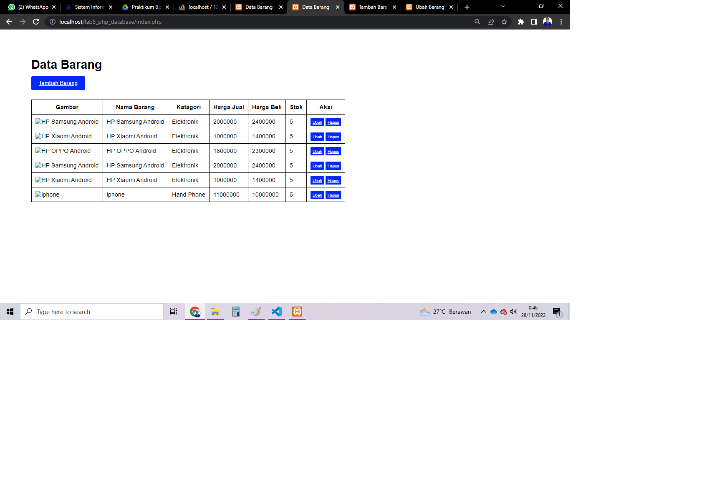

# Lab8Web
### Praktikum 8: PHP dan Database MySQL
### Apa itu Database?
kumpulan data terstruktur yang saling berelasi. Kumpulan data, yang terorganisir secara logika,
dikelola menggunakan metode tertentu yang menjamin konsistensi data.
### Menjalankan MySQL Server
Untuk menjalankan MySQL Server dari menu XAMPP Contol.

### Mengakses MySQL Client menggunakan PHP MyAdmin
Pastikan webserver Apache dan MySQL server sudah dijalankan. Kemudian buka
melalui browser: http://localhost/phpmyadmin/

### Membuat Database: Studi Kasus Data Barang
Membuat database dengan nama latihan1

### Membuat Table data_barang
Lalu buatlah table dengan nama data_barang lalu klik buat

### Mengisi tabel pada data barang
Lalu isilah table pada data barang sesusai dengan intuksi praktikum lalu klik simpan

### Menambahkan data
Lalu tambahkan data sesuai dengan data yang ada di praktikum, dengan cara masuk ke menu SQL lalu klik kolom insert dan masukan data yang akan di tambahkan lalu klik kirim

### Membuat Program CRUD
Buat folder lab8_php_database pada root directory web server (d:\xampp\htdocs)
Kemudian untuk mengakses direktory tersebut pada web server dengan mengakses URL:
http://localhost/lab8_php_database/

### Membuat file koneksi database
Buat file baru dengan nama koneksi.php.
Lalu masukan kode seperti berikut ini:
Buka melalui browser untuk menguji koneksi database (untuk menyampilkan pesan
koneksi berhasil, uncomment pada perintah echo "koneksi berhasil";

### Membuat file index untuk menampilkan data (Read)
Buat file baru dengan nama index.php
Lalu masukan kode seperti berikut ini:

dan ini hasilnya :

### Menambah Data (Create)
Buat file baru dengan nama tambah.php
lalu masukan kode seperti berikut:

dan ini form penambahan nya :

dan ini hasilnya :

### Mengubah Data (Update)
Buat file baru dengan nama ubah.php
lalu masukan kode seperti berikut :

dan ini form ubah nya :

### Menghapus Data (Delete)
Buat file baru dengan nama hapus.php
lalu masukan kode seperti berikut ini :

dan hasilnya seperti ini, barang iphone telah di hapus :

### Masukan Style untuk table nya
Jangan lupa buat koding style pada css untuk menambahkan variasi pada table nya dengan memasukan kode berikut :

